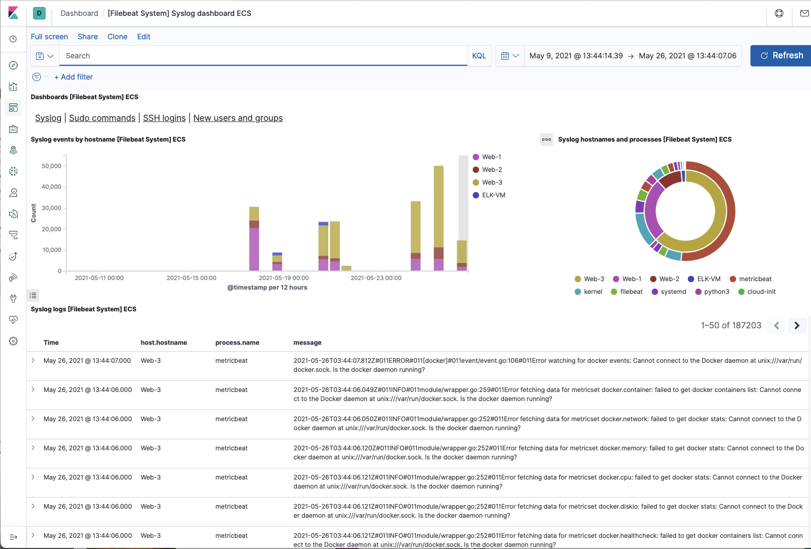
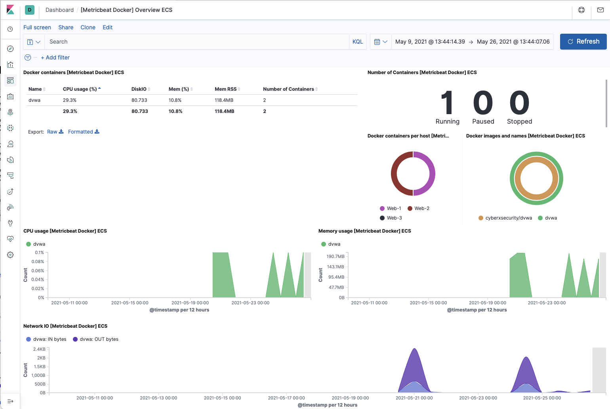

Automated ELK Stack Deployment

  

  

The files in this repository were used to configure the network depicted below.

  
  


  

These files have been tested and used to generate a live ELK deployment on Azure. They can be used to either recreate the entire deployment pictured above.

  

Alternatively, select portions of the ansible playbook and config file may be used to install only certain pieces of it, such as Filebeat.

  

  

[Ansible/hosts.txt](Ansible/Ansible:hosts.txt)

  

  

[Ansible/dvwa_playbook.yml](Ansible/Ansible:dvwa_playbook.yml)

  

  

[Ansible/ansible_config.txt](Ansible/Ansible:ansible_config.txt)

  

  

[Ansible/elk.yml](Ansible/Ansible:elk.yml)

  

  

[Ansible/filebeat-playbook.yml](Ansible/Ansible:filebeat-playbook.yml)

  

  

[Ansible/filebeat_config.txt](Ansible/Ansible:filebeat_config.txt)

  

  

[Ansible/metricbeat_playbook.yml](Ansible/Ansible:metricbeat_playbook.yml)

  

  

[Ansible/metricbeat_config.txt](Ansible/Ansible:metricbeat_config.txt)

  

  

This document contains the following details:

  

- Description of the Topology

  

- Access Policies

  

- ELK Configuration

  

- Beats in Use

  

- Machines Being Monitored

  

- How to use the Ansible Build

  

  

Description of the Topology

  

  

The main purpose of this network is to expose a load-balanced and monitored instance of DVWA, the D*mn Vulnerable Web Application.

  

  

Load balancing ensures that the application will be highly available, in addition to restricting access to the network.

  

  

What aspect of security do load balancers protect?

  

- A load balancer is a device that acts as a reverse proxy and distributes network or application traffic across a number of servers. Load balancers are used to increase capacity (concurrent users) and reliability of applications. Load balancers protects the system from DDoS attacks by shifting attack traffic. The advantage of a jump box is to give access to the user from a single node that can be secured and monitored.

  

What is the advantage of a jump box?

  

- A jump box is a secure computer that all admins first connect to before launching any administrative task or use as an origination point to connect to other servers or untrusted environments.

  

  

Integrating an ELK server allows users to easily monitor the vulnerable VMs for changes to the files and system statistics.

  

  

What does Filebeat watch for?

  

- Filebeat is a logging agent installed on the machine generating the log files, tailing them, and forwarding the data to either Logstash for more advanced processing or directly into Elasticsearch for indexing.

  

What does Metricbeat record?

  

  

- Collect metrics from your systems and services. From CPU to memory, Redis to NGINX, and much more, Metricbeat is a lightweight way to send system and service statistics.

  

  

The configuration details of each machine may be found below.

  

|Name|Function|IP Address|Operating System|  
|-------|----------|------|----------|  
|Jump Box|Gateway|10.0.0.11|Linux|  
|Web 1|Webserver (DVWA)|10.0.0.12|Linux|  
|Web 2|Webserver (DVWA)|10.0.0.13|Linux|  
|Web 3|Webserver (DVWA)|10.0.0.14|Linux|  
|ELK-VM|Elastic Server|10.1.0.5|Linux|  

  

Access Policies

  

  

The machines on the internal network are not exposed to the public Internet.

  

  

Only the Jump Box machine can accept connections from the Internet. Access to this machine is only allowed from the following IP addresses:

  

  

- [Your Public IP address] e.g [121.44.99.203]

  

  

Machines within the network can only be accessed by Jump Box virtual machine.

  

  

- The Jump Box VM has access to the Web VM 1/2/3 & ELK VM.

  

- The IP address of the Jump Box VM is 10.0.0.11

  

- The Jump Box VM has access to the Web VM 1/2/3 & ELK VM . The IP address of the Jump Box VM is 10.0.0.11

  

  

A summary of the access policies in place can be found in the table below.

  

  

Name|Publicly Accessible|Allowed IP Addresses|  
|-------|----------|------|  
|Jump Box|Yes / SSH-22|119.18.22.67|  
|Web 1|No|WEB LB 121.44.99.203,10.0.1.11|  
|Web 2|No|WEB LB 121.44.99.203,10.0.1.11|  
|Web 3|No|WEB LB 121.44.99.203,10.0.1.11|  
|ELK-VM|Yes / TCP 5601/9200|10.1.0.5, 10.0.1.12/13/14|
|Load Balancer|Yes / HTTP 80|[Personal IP] 121.44.99.203|

  

Elk Configuration

  

  

Ansible was used to automate configuration of the ELK machine. No configuration was performed manually, which is advantageous because...

  

  

- Ansible allows IT administrators to automate their daily tasks and save a lot of time. That frees them to focus on efforts that help deliver more value to the business by spending time on more important tasks.

  

  

The playbook implements the following tasks:

  

  

- Install Docker

  

- Install python3-pip

  

- Install Docker python module

  

- Set the vm.max_map_count to 262144

  

- Download and launch a docker elk container

  

The following screenshot displays the result of running docker ps after successfully configuring the ELK instance.

  

  


  

  

Target Machines & Beats

  

  

This ELK server is configured to monitor the following machines

  

  

- Web-1, 10.0.0.12

  

- Web-2, 10.0.0.13

  

- Web-3, 10.0.0.14

  

  

We have installed the following Beats on these machines

  

  

- Filebeat

  

- Metricbeat

  

  

These Beats allow us to collect the following information from each machine

  

  

- Filebeat allows us to collect system log events from the host machines

  

- Metricbeat allows us to collect metrics and system statistics from host machines.

  

Using the Playbook

  

  

In order to use the playbook, you will need to have an Ansible control node already configured. Assuming you have such a control node provisioned:

  

  

SSH into the control node and follow the steps below

  

- Copy the filbeat.cfg file to /etc/ansible/filebeat-config.yml.

  

- Update the filebeat-config.yml file to include

  

  

>

  

output.elasticsearch:

  

hosts: ["10.1.0.5:9200"]

  

username: "elastic"

  

password: "changeme"

  

setup.kibana:

  

host: "10.1.0.5:5601"

  

  

- Save this file in /etc/ansible/files/filebeat-config.yml.

  

  

- Run the playbook, and navigate to *http://[your_elk_server_ip]:5601/app/kibana* to check that the installation worked as expected.

  

  

Answer the following questions to fill in the blanks:

  

Which file is the playbook? Where do you copy it?

  

- filebeat-config.yml is the playbook and we copied this to /etc/filebeat/filebeat.yml

  

  

Which file do you update to make Ansible run the playbook on a specific machine?

  

  

- Updated the Ansible containter host file etc/ansible/host.

  

- Added a group called [elk] and specify the Private IP of ELK-VM [10.1.0.5]

  

  

How do I specify which machine to install the ELK server on versus which to install Filebeat on?

  

  

# /etc/ansible/hosts

  

```

  

[webservers]

  

10.0.0.12 ansible_python_interpreter=/usr/bin/python3

  

10.0.0.13 ansible_python_interpreter=/usr/bin/python3

  

10.0.0.14 ansible_python_interpreter=/usr/bin/python3

  

  

[elk]

  

10.1.0.5 ansible_python_interpreter=/usr/bin/python3

  

  

```

  

  

- Then I updated filebeat-playbook.yml & metricbeat-playbook.yml header part

  

```

  

name: installing and launching metricbeat

  

hosts: webservers

  

become: yes

  

tasks:

  

```

  

  

Which URL do you navigate to in order to check that the ELK server is running?

  

  

- The public IP of ELK stack with allowed port number [20.37.39.83:5601].

  

  

_As a **Bonus**, provide the specific commands the user will need to run to download the playbook, update the files, etc._

  

  

- On the Jump box run the following command to get the playbook: curl

  

[https://github.com/Honzabocek91/Project_ELK/blob/main/Ansible/Ansible:elk.yml](Ansible/Ansible:elk.yml) > /etc/ansible/elk.yml

  

  

- Edit the hosts file in /etc/ansible and add the details from the screenshot and update your ip addresses

  

  

- #/etc/ansible/nano hosts

  

`[elk]

  

10.1.0.5 ansible_python_interpreter=/usr/bin/python3

  

`

  

  

- To run the Playbook: ansible-playbook /etc/ansible/elk.yml

  

  

- Check your installation is working by visiting in a browser: http://[your_elk_server_ip]:5601/app/kibana

  


  

  

Installing Filebeat:

  

  

- Download the playbook with the following command: curl

  

[https://github.com/Honzabocek91/Project_ELK/blob/main/Ansible/Ansible:filebeat-playbook.yml](Ansible/Ansible:filebeat-playbook.yml) > /etc/ansible/roles/filebeat-playbook.yml

  

- Run the playbook with: ansible-playbook /etc/ansible/filebeat-playbook.yml

  

You should begin seeing information such as the following:

  



  

  

Installing Metricbeat:

  

  

- Download the playbook with the following command: curl

  

[https://github.com/Honzabocek91/Project_ELK/blob/main/Ansible/Ansible:metricbeat_playbook.yml](Ansible/Ansible:metricbeat_playbook.yml) > /etc/ansible/roles/metric_playbook.yml

  

- Run the playbook with: ansible-playbook /etc/ansible/metricbeat_playbook.yml

  

You should begin seeing information such as the following:

  

